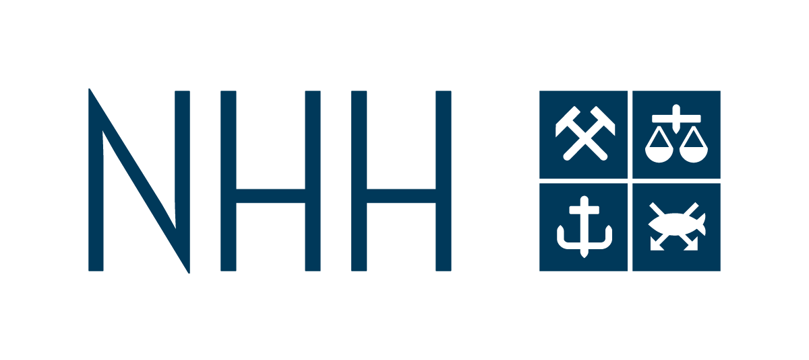

```{r, include=FALSE}
knitr::opts_chunk$set(
  results='asis', 
  echo = FALSE
)

library(glue)
library(tidyverse)

# ======================================================================
# These variables determine how the the data is loaded and how the exports are
# done.

# Is data stored in google sheets? If no data will be gather from the csvs/
# folder in project
using_googlesheets <- TRUE

# Just the copied URL from the sheet
positions_sheet_loc <- "https://docs.google.com/spreadsheets/d/1QaWldSn166FR1pwyurwo1Ag0lv0yMN8y5ESi3k89mec"

# Is this sheet available for anyone to read? If you're using a private sheet
# set this to false and go to gather_data.R and run the data loading manually
# once to cache authentication
sheet_is_publicly_readable <- TRUE

# Is the goal of this knit to build a document that is exported to PDF? If so
# set this to true to have links turned into footnotes at the end of the
# document
PDF_EXPORT <- FALSE


CV_PDF_LOC <- "https://github.com/keita43a/cv/raw/master/keita_abe_cv.pdf"
CV_HTML_LOC <- ""


# A global (gasp) variable that holds all the links that were inserted for
# placement at the end
links <- c()

# ======================================================================
# Now we source two external scripts. One contains functions for building the
# text output and the other loads up our data from either googlesheets or csvs

# Functions for building sections from CSV data
source('parsing_functions.R') 

# Load data for CV/Resume
source('gather_data.R')
```


```{r}
# When in export mode the little dots are unaligned, so fix that. 
if(PDF_EXPORT){
  cat("
  <style>
  :root{
    --decorator-outer-offset-left: -6.5px;
  }
  </style>")
}
```


Aside
================================================================================


{width=100%}

```{r}
# When in export mode the little dots are unaligned, so fix that. 
if(PDF_EXPORT){
  glue("View this CV online with links at _{CV_HTML_LOC}_")
} else {
  glue("[<i class='fas fa-download'></i> Download a PDF of this CV]({CV_PDF_LOC})")
}
```

Contact {#contact}
--------------------------------------------------------------------------------

```{r}
contact_info %>% 
  glue_data("- <i class='fa fa-{icon}'></i> {contact}")
```


Skills {#skills}
--------------------------------------------------------------------------------

```{r}
build_skill_bars(skills)
```

Language {#lang}
--------------------------------------------------------------------------------

```{r}
build_skill_bars(lang)
```

Disclaimer {#disclaimer}
--------------------------------------------------------------------------------

Made with the R package [**pagedown**](https://github.com/rstudio/pagedown). 

I built this cv based on the source code available at [github.com/nstrayer/cv](https://github.com/nstrayer/cv).

Last updated on `r Sys.Date()`.


Main
================================================================================

Keita Abe {#title}
--------------------------------------------------------------------------------

```{r}
print_text_block(text_blocks, 'intro')
```


Education {data-icon=graduation-cap data-concise=true}
--------------------------------------------------------------------------------

```{r}
print_section(position_data, 'education')
```


Research Positions {data-icon=laptop}
--------------------------------------------------------------------------------

```{r}
print_section(position_data, 'research_positions')
```


<br>
<br>
<br>

Teaching Experience {data-icon=chalkboard-teacher}
--------------------------------------------------------------------------------

::: aside
```{r}
print_text_block(text_blocks, 'teaching_experience_aside')
```
:::

```{r}
print_section(position_data, 'teaching_positions')
```


Publications {data-icon=book}
--------------------------------------------------------------------------------

::: aside
```{r}
print_text_block(text_blocks, 'academic_articles_aside')
```
:::

```{r}
print_section(position_data, 'academic_articles')
```

Working Papers {data-icon=book-open}
--------------------------------------------------------------------------------

```{r}
print_section(position_data, 'working_papers')
```

Work in Progress {data-icon=file-word}
--------------------------------------------------------------------------------

```{r}
print_section(position_data, 'work_in_progress')
```

Awards {data-icon=trophy}
--------------------------------------------------------------------------------

```{r}
print_section(position_data, 'awards')
```

Fellowships and Scholarships {data-icon=award}
--------------------------------------------------------------------------------

```{r}
print_section(position_data, 'fellowships')
```

Workshops {data-icon=handshake}
--------------------------------------------------------------------------------

```{r}
print_section(position_data, 'workshops')
```


```{r}
if(PDF_EXPORT){
  cat("
  
Links {data-icon=link}
--------------------------------------------------------------------------------

<br>


")
  
  walk2(links, 1:length(links), function(link, index){
    print(glue('{index}. {link}'))
  })
}
```


